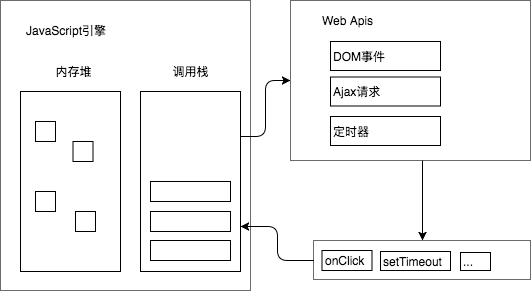
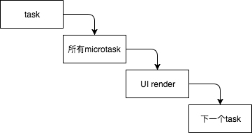

浏览器中，整个JavaScript的运行环境，在Render进程中。帮助JavaScript运行起来的主要线程包括：

- JavaScript 引擎线程
- 事件触发线程
- 定时器线程
- 异步http线程

先说明一下浏览器中JavaScript事件循环的整体流程，再来看各个线程在其中起的作用。

------

#### 浏览器事件循环

浏览器事件循环的总体流程如下：




各组成部分：

- JavaScript引擎，进行JavaScript的解析与执行，所有JavaScript代码的执行全部在JavaScript引擎中
- WebApis。由浏览器提供的api，执行例如DOM事件、Ajax请求、定时器等任务。其中包括定时器线程、异步http线程等webapi对应的线程，他们负责进行进行对应的api调用，而且不属于JavaScript引擎。
- 事件循环队列。维护回调事件组成的队列

整体流程：

- JavaScript引擎根据调用栈中的函数调用，依次执行JavaScript代码。其中，若调用有调用Webapi，则对相应Api进行调用，注册对应api调用与回调事件。如代码为`setTimeout(()=>console.log("here"),100)`，则调用定时器。
- Webapi执行对应调用，当执行完成后，将回调函数传递给事件循环队列。事件循环队列接受回调后，将此回调放在事件循环队列最后。比如上述的`setTimeout`定义了100ms的定时，则定时器开始计时，到100ms时，将回调`()=>console.log("here")`传递给事件循环队列。
- 当调用栈为空时，JavaScript从事件循环队列开头去除回调函数，放入调用栈中，执行回调。

------


#### JavaScript引擎

如上图所示，JavaScript引擎中主要包括两大部分：

- 内存堆，提供程序运行所需内存
- 调用栈，维护JavaScript程序调用栈

JavaScript是单线程的，而这个单线程，也就是说在JavaScript引擎中，在一个特定时间，JavaScript只能执行一个任务，一行代码，不能同时执行多项任务。代码的执行顺序，则严格按照调用栈的程序调用顺序。


##### 调用栈

调用栈维护的程序调用及返回顺序，调用栈是一个先进后出的栈结构。

- 每次对函数的调用，将会把此函数压入栈底
- 每次函数返回，则将函数从栈顶释放

比如以下代码：

```javascript
function c(){
  console.log("c");
}

function b(){
  console.log("b");
  c();
}

function a(){
  console.log("a");
  b();
}

a()
```

代码执行即对应调用栈为：

- 开始执行代码，调用栈为 main 
- 执行a。调用栈：main —> a
- 函数a执行，执行`console.log("a")`。调用栈：main —> a —> console.log
- `console.log`执行，打印`a`，然后退出`console.log`，调用栈变为 main —> a
- 执行`b()`，调用b函数，进入函数b中，调用栈变为 main —> a —> b
- 然后执行`console.log`，调用栈变为 main —> a —> b —> console.log
- `console.log`执行完毕，调用栈变为 main —> a —> b
- 然后调用c，进入c函数，调用栈变为 main —> a —> b —> c
- 执行 `console.log`，调用栈变为 main —> a —> b —> c —> console.log
- `console.log`执行完毕，调用栈变为 main —> a —> b —> c
- 从c函数退出，回到b函数，调用栈变为main —> a —> b
- 从b函数退出，调用栈变为main —> a 
- 从a函数退出，调用栈变为 main
- 代码执行完毕，调用栈变为空


##### 调用循环队列

JavaScript引擎会按照代码从上往下进行调用执行

- 执行流程形成调用栈
- 执行过程中，若需要对webapi进行调用，则调用webapi
- 当代码执行完毕调用栈为空时，便开始执行事件循环队列中的回调
- 每次从事件循环队列的头部获取一个回调，执行此回调时，依然形成对此回调执行的调用栈
- 当上一个回调执行结束，调用栈回到空状态，则从事件循环队列获取一下一个回调，并进行执行
- 循环上述流程，直到将所有回调全部执行完毕


------


#### webApi与事件循环队列

webApis中包含各种浏览器Api调用，比如

- DOM api，根据JavaScript，注册各类事件，比如点击事件，注册后，若用户进行点击，则将点击事件回调传递给事件循环队列
- 定时器，若JavaScript执行`setTimeout`或`setInterval`，则向定时器注册定时任务，定时器将进行计时，达到执行事件后，将定时器回调传递给事件循环队列
- http事件同理，进行http请求，请求结束后，将请求回调及请求数据传递给事件循环队列

事件循环队列每次收到webApi传递来的回调事件及回调数据，则将回调事件及数据放在队列最后，当 JavaScript 调用栈为空时，从循环队列开头，依次将一个个回调事件及数据传递给JavaScript引擎进行执行。


------

#### 异步代码执行流程

综合上述内容，若代码如下：

```javascript
console.log("a");

setTimeout(()=>{
  console.log("timeout");
},0)

console.log("b");
```

执行流程为：

- 调用`console.log`，调用栈变为 main —> console.log ，`console.log`执行完毕后，调用栈回到 main
- 执行`setTimeout`，调用webapi的定时器，将回调函数传递给定时器，由于设置的超时时间为0，定时器此时会立马把回调传递给时间循环队列，时间循环队列将回调放入队列中
- 此时JavaScript执行扔在主代码序列中，调用栈为 main 。继续往下，进入 `console.log("b")`，执行`console`，调用栈变为 main —> console，`console.log("b")`调用结束，调用栈回到 main
- `console.log("b")`执行完毕后，主代码序列全部执行完毕，调用栈变为空
- 此时，开始从循环队列中取出回调进行执行，于是，取出`()=>console.log("timeout")`，进行执行，从代码开始执行到执行完毕，调用栈先变为 console.log，后变为空

------


#### macrotask & microtask

在上面的讲述中，事件循环队列只是一个队列，然而实际上，并不是只有一个队列。然而，事实上应该有两个主要的执行队列。

- macrotask
  - 宏任务，也被称为task，从概念上来说，可以看做是一个执行主体。在执行时，是一个task接着一个task，依次进行执行的。
  - 被认为是宏任务的内容包括：setTimeout、setInterval、I/O
- microtask
  - 微任务。会尽快被执行的任务，包括：原生promise、process.nextTick(Node中)


##### 执行流程

macrotask、microtask、UI渲染，三者，在某个时刻，只能有一个在执行，它们的执行流程为：



- 在执行时，会先取一个task执行
- task执行完毕后，获取执行期间的所有microtask，把所有microtask全部执行完毕
- 若JavaScript执行对UI有改变，则执行UI渲染
- UI渲染完成后，进行下一个task的执行
- 按照上述步骤循环往复

所以，以下代码：

```javascript
console.log("a");

setTimeout(()=>console.log("b"),0);

Promise.resolve().then(()=>{
	console.log("c");
}).then(()=>{
  console.log("d");
})

console.log("e");
```

执行的打印顺序为`a - e - c - d - b`

------


参考内容

https://www.youtube.com/watch?v=8aGhZQkoFbQ

https://www.i-programmer.info/programming/javascript/11337-javascript-async-microtasks.html

http://www.dailichun.com/2018/01/21/js_singlethread_eventloop.html

