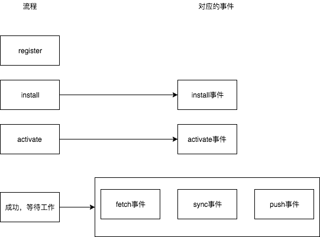

Service Worker，其主要作用是作为一个网页与Web服务器间的代理服务器。它可以缓存资源，并在网页请求对应资源时，劫持网页请求，直接返回已缓存的资源，从而节省网络加载时间，以及在无网络条件下正常加载页面。

------

#### 工作流程

整体工作流程如下：



- 加载并执行主线程JavaScript，主线程调用`serviceWorkerContainer.register()`注册service worker
  - `serviceWorkerContainer.register()`包含两个参数，第一个参数是指定service worker脚本的url地址第二个参数为可选配置项
  - 调用此方法后，将会调用浏览器API执行service worker的注册操作
  - 此方法返回一个Promise，可以通过指定`resolve`方法对service worker进行检测，也可以指定`reject`方法捕获错误
- 注册service worker后，service work在一个被称作`ServiceWorkerGlobalScope`的执行上下文中被执行，这个执行环节是独立于主线程的，无DOM操作权限。
- service worker在注册及工作过程中，浏览器会通过事件的方式告知service worker所处的阶段以及网页发起的请求等。service worker通过注册事件处理器来对这些事件进行反应，做出相应处理
- 在主线程进行注册后，service worker首先收到的是`install`事件，这个事件表示service worker的安装，可以在此事件的事件处理器中执行建立`IndexedDB`、初始化缓存内容的事务。`install`事件的事件处理器执行完毕后，即表示此service worker已安装
- 之后是`activate`事件，activate事件主要用来清理老版本service worker的过期资源，从而达到释放存储空间等目的。
- 在这之后，service worker即会正式接管页面
  - 此时，service woker处于监听状态，比如，如果网页发起请求，浏览器便会通过`fetch`事件，将请求移交给service worker，service worker内部可以通过注册`fetch`事件处理器，来处理网页请求
  - 需要注意的是，service worker接管的页面，是在完成注册之后打开的页面，所以原注册页面不会被接管，如果需要被接管，页面需要被刷新

------

#### 代码

结合[MDN上的一个实例](https://developer.mozilla.org/en-US/docs/Web/API/Service_Worker_API/Using_Service_Workers#Basic_architecture)来说明一下service worker的工作流程，具体代码可见[github仓库](https://github.com/mdn/sw-test/)。

- 如下代码，app.js在主线程中执行，调用`navigator.serviceWorker.register`注册service worker，将文件`sw.js`中的脚本加载进service worker的执行环境进行执行

```javascript
// app.js

if ('serviceWorker' in navigator) {
  navigator.serviceWorker.register('./sw.js').then(function(reg) {

    if(reg.installing) {
      console.log('Service worker installing');
    } else if(reg.waiting) {
      console.log('Service worker installed');
    } else if(reg.active) {
      console.log('Service worker active');
    }

  }).catch(function(error) {
    // registration failed
    console.log('Registration failed with ' + error);
  });
}

```

- 此脚本在service worker执行环境中注册了install事件处理器，当service worker的install事件被触发时，事件处理器被调用。在此事件处理器中，调用`event.waitUntil`将install延迟至`watiUntil`中的内容处理完毕。在`waituntil`中，初始化了一个名称为`v1`的缓存器，并将页面所需资源添加至缓存器中。

```javascript
// sw.js

self.addEventListener('install', function(event) {
  event.waitUntil(
    caches.open('v1').then(function(cache) {
      return cache.addAll([
        './',
        './index.html',
        './style.css',
        './app.js',
        './image-list.js',
        './star-wars-logo.jpg',
        './gallery/bountyHunters.jpg',
        './gallery/myLittleVader.jpg',
        './gallery/snowTroopers.jpg'
      ]);
    })
  );
});
```

- 注册`fetch`事件，当网页发起请求时，浏览器会触发fetch事件，并将网络请求以`event.request`的方式传递给service worker。在此处理过程中，通过`cache.match`来匹配缓存器中对应的资源。如果资源已经存在，`response`不为undfined，则直接将此资源返回，不再发起网络请求。若资源不存在，则通过`fetch`发起网络请求，获得资源后，先通过`cache.put`将资源存储至缓存器中，然后将资源返回给网页。

```javascript
// sw.js

self.addEventListener('fetch', function(event) {
  event.respondWith(caches.match(event.request).then(function(response) {
    if (response !== undefined) {
      return response;
    } else {
      return fetch(event.request).then(function (response) {
        let responseClone = response.clone();
        caches.open('v1').then(function (cache) {
          cache.put(event.request, responseClone);
        });
        return response;
      }).catch(function () {
        return caches.match('./gallery/myLittleVader.jpg');
      });
    }
  }));
});
```

------

#### 更多

- 对于activate事件，其用法和install事件类似，它可以用来清楚老版本的过期资源，具体实例可见[MDN文档](https://developer.mozilla.org/en-US/docs/Web/API/Service_Worker_API/Using_Service_Workers#Updating_your_service_worker)
- servcie worker除了用来做缓存外，还可以用来进行消息推送等，详情可见：https://serviceworke.rs/push-get-payload.html

------

参考

- https://developer.mozilla.org/en-US/docs/Web/API/Service_Worker_API/Using_Service_Workers
- https://lavas.baidu.com/pwa/offline-and-cache-loading/service-worker/service-worker-introduction
- https://serviceworke.rs/push-get-payload.html
- https://developers.google.com/web/fundamentals/primers/service-workers/