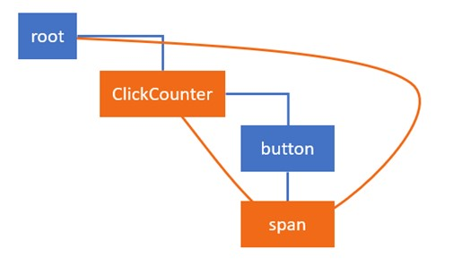
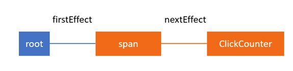

在上[一篇文章](https://medium.com/react-in-depth/inside-fiber-in-depth-overview-of-the-new-reconciliation-algorithm-in-react-e1c04700ef6e)中，我讲解了一些基础，这些基础是理解这篇文章中描述更新过程中的技术细节所必需的。

我讲述了在这篇文章中会用到的主要数据结构和概念，特别是 Fiber 节点、current 和 work-in-progress 树、副作用和副作用列表。我也提供了一个主要算法的概览，并说明了 render 阶段和 commit 阶段的不同点。如果你还没有阅读上一篇文章，我推荐你从那里开始。

我也介绍了一个简单的应用，只有一个按钮，点击后会增加渲染在屏幕上数字的大小。


它的实现如下：

```javascript
class ClickCounter extends React.Component {
  constructor(props) {
    super(props);
    this.state = { count: 0 };
    this.handleClick = this.handleClick.bind(this);
  }

  handleClick() {
    this.setState(state => {
      return { count: state.count + 1 };
    });
  }

  componentDidUpdate() {}

  render() {
    return [
      <button key="1" onClick={this.handleClick}>
        Update counter
      </button>,
      <span key="2">{this.state.count}</span>
    ];
  }
}
```

在这里我给组件添加了`componentDidUpdate`生命周期方法，它将用于展示在 React 在 commit 阶段如添加影响，调用这个方法。

在这篇文章中，我想向你展示 React 如何处理状态更新并建立副作用列表。我们将带你看到在 render 和 commit 阶段的高级函数中发生了什么。

特别的，我们将看到在`completeWork`函数中，React 如何：

- 更新`ClickCounter` `state`中的`count`属性
- 调用`render`方法来获得一个子元素列表并执行对比
- 更新`span`元素的属性

和在`commitRoot`中，React：

- 更新`span`元素的`textContent`属性
- 调用`componentDidUpdate`生命周期方法

在那之前，让我们先快速看一下当我们在点击处理函数中调用`setState`方法时，工作时如何调度的。

注意，你不用理解这些也能使用 React，这篇文章时关于 React 内部是如何工作的。

--- 

#### 调度更新

当我们点击按钮时，`click`事件被触发，React 执行被传入 button 属性的回调。在我们的应用中，它仅仅增加计数并更新状态。

```javascript
class ClickCounter extends React.Component {
    ...
    handleClick() {
        this.setState((state) => {
            return {count: state.count + 1};
        });
    }
}
```

每个 React 组件有一个与之相关联的`updater`，它作为一个桥梁，连接组件和 React 核心。这使得`setState`能够能够被 React DOM、ReactNative、服务端渲染和测试工具中被以不同的方式进行实现。

在这篇文章中，我们将看到 ReactDOM 中`updater`对象的实现，而 React DOM 中私用的则是 Fiber reconciler。对于`ClickCounter`组件来说，这个`updater`是`classComponentUpdater`。它负责获取一个 Fiber 实例、队列更新以及调度工作。

当更新被加入队列中，他们被加入到需要在一个 Fiber 节点上被处理的更新的队列中。在我们的例子中，与`ClickCounter`组件相关联的 Fiber 节点有以下结构：

```javascript
{
    stateNode: new ClickCounter,
    type: ClickCounter,
    updateQueue: {
         baseState: {count: 0}
         firstUpdate: {
             next: {
                 payload: (state) => { return {count: state.count + 1} }
             }
         },
         ...
     },
     ...
}
```

正如你所能够看到的，`updateQueue.firstUpdate.next.payload`中的函数时我们传入到`ClickCounter`组件`setState`中的回调。它代表的是，在 render 阶段需要被处理的第一个更新。

--- 

#### 处理 ClickCounter Fiber node 的更新

我上篇文章中[有关工作循环的章节](https://medium.com/react-in-depth/inside-fiber-in-depth-overview-of-the-new-reconciliation-algorithm-in-react-e1c04700ef6e)解释了`nextUnitOfWork`全局变量的作用。具体来说，章节中降到了，这个变量包含一个引用，指向`workInProgress`树中有工作需要被执行的 Fiber 节点。当 React 遍历 Fiber 树时，它使用这个遍历来知道是否有其他 Fiber 节点有未被完成的工作。

让我们假设`setState`节点被调用了，React 把来自`setState`的回调增加到`ClickCounter`fiber 节点的`updateQueue`中，并且开始调度工作。React 进入 render 阶段。它从最高的`HostRoot`Fiber 节点开始，使用`renderRoot`方法来遍历树。然而，它会跳过已经被处理过的 Fiber 节点，直到发现一个有未处理工作的节点。在我们的例子中，只有一个 Fiber 节点有未完成工作，他就是`ClickCounter`Fiber 节点。

所有的工作都会在这个 Fiber 节点的克隆副本上进行，这个克隆父辈被存放在`alternate`属性上。如果这个 alternate 节点还没有被创建，则 React 会在处理更新前，调用`createWorkInProgress`方法创建副本。让我们假设，变量`nextUnitOfWork`中存放了一个 alternate `ClickCounter` Fiber 节点的引用。

##### beginWork

首先，我们的 Fiber 进入到[beginWork](https://github.com/facebook/react/blob/cbbc2b6c4d0d8519145560bd8183ecde55168b12/packages/react-reconciler/src/ReactFiberBeginWork.js#L1489)。

> 因为这个方法会在一个树的每个 Fiber 节点上被执行，所以如果你想要 debug render 阶段，这个地方是一个打断点的好地方。我在这里打断点，并区检查一个 Fiber 节点的类型，来找到我需要的那个。

`beginWork`函数时一个大的`switch`语句，通过 Fiber 节点的 tag 来判断什么类型的工作需要在这个 Fiber 节点上被执行，然后执行对应的函数来处理工作。当`CountClicks`是一个类组件时，这个分支时这样的：

```javascript
function beginWork(current$$1, workInProgress, ...) {
    ...
    switch (workInProgress.tag) {
        ...
        case FunctionalComponent: {...}
        case ClassComponent:
        {
            ...
            return updateClassComponent(current$$1, workInProgress, ...);
        }
        case HostComponent: {...}
        case ...
}
```

然后我们进入到了`updateClassComponent`方法。根据这是组件的第一次渲染、或者时组件更新的恢复再或者是组件的更新，React 会创建一个实例、或者挂载这个组件再或者更新它：

```javascript
function updateClassComponent(current, workInProgress, Component, ...) {
    ...
    const instance = workInProgress.stateNode;
    let shouldUpdate;
    if (instance === null) {
        ...
        // In the initial pass we might need to construct the instance.
        constructClassInstance(workInProgress, Component, ...);
        mountClassInstance(workInProgress, Component, ...);
        shouldUpdate = true;
    } else if (current === null) {
        // In a resume, we'll already have an instance we can reuse.
        shouldUpdate = resumeMountClassInstance(workInProgress, Component, ...);
    } else {
        shouldUpdate = updateClassInstance(current, workInProgress, ...);
    }
    return finishClassComponent(current, workInProgress, Component, shouldUpdate, ...);
}
```

##### 处理 ClickCounter Fiber 的更新

我们已经有了一个`ClickCounter`组件的实例，所以我们进入到`updateClassInstance`方法中。这是 React 执行大部分类组件工作的地方。在这个函数中执行的重要操作，安装执行顺序排列如下：

- 调用`UNSAFE_componentWillReceiveProps()`钩子（deprecated）
- 处理`updateQueue`中的更新，并产生一个新的状态
- 使用新状态调用`getDerivedStateFromProps`获得结果
- 调用`shouldComponentUpdate`来保证组件确实需要被更新；如果结果为 false，则跳过整个渲染阶段，包括在这个组件和其子组件上调用 render；否则则处理更新
- 调用`UNSAFE_componentWillUpdate`（depricated）
- 增加一个影响，用来出发`componentDidUpdate`生命周期钩子

> 虽然调用`componentDidUpdate`的影响时在 render 阶段被添加的，但是这个方法时在 commit 阶段被执行的。

- 在组件实例上更新`state`和`props`

> state 和 props 子 render 方法被调用之前在组件实例上被更新，因为 render 方法的结果往往取决于 state 和 props。如果不这样做，每次 render 方法都将返回相同的结果。

下面是这个方法的一个简化版本：

```javascript
function updateClassInstance(current, workInProgress, ctor, newProps, ...) {
    const instance = workInProgress.stateNode;

    const oldProps = workInProgress.memoizedProps;
    instance.props = oldProps;
    if (oldProps !== newProps) {
        callComponentWillReceiveProps(workInProgress, instance, newProps, ...);
    }

    let updateQueue = workInProgress.updateQueue;
    if (updateQueue !== null) {
        processUpdateQueue(workInProgress, updateQueue, ...);
        newState = workInProgress.memoizedState;
    }

    applyDerivedStateFromProps(workInProgress, ...);
    newState = workInProgress.memoizedState;

    const shouldUpdate = checkShouldComponentUpdate(workInProgress, ctor, ...);
    if (shouldUpdate) {
        instance.componentWillUpdate(newProps, newState, nextContext);
        workInProgress.effectTag |= Update;
        workInProgress.effectTag |= Snapshot;
    }

    instance.props = newProps;
    instance.state = newState;

    return shouldUpdate;
}
```

在上面的代码片段中，我移除了一些辅助代码。比如说，在调用生命周期周期方法或增加触发他们的影响时之前，React 会使用`typeof`操作符检查一个组件是否实现了这些方法。比如说，增加影响前，对`componentDidUpdate`方法的检查：

```javascript
if (typeof instance.componentDidUpdate === "function") {
  workInProgress.effectTag |= Update;
}
```

所以，我们知道了在 render 阶段，会有哪些操作在`ClickCounter`Fiber 节点上执行。让我们现在来看看这些操作如何更不 Fiber 节点上的值。当 React 开始工作时，`ClickCounter`对应的 Fiber 节点看起来类似于下面的样子：

```javascript
{
    effectTag: 0,
    elementType: class ClickCounter,
    firstEffect: null,
    memoizedState: {count: 0},
    type: class ClickCounter,
    stateNode: {
        state: {count: 0}
    },
    updateQueue: {
        baseState: {count: 0},
        firstUpdate: {
            next: {
                payload: (state, props) => {…}
            }
        },
        ...
    }
}
```

完成工作后，FIber 节点将看起来像这样：

```javascript
{
    effectTag: 4,
    elementType: class ClickCounter,
    firstEffect: null,
    memoizedState: {count: 1},
    type: class ClickCounter,
    stateNode: {
        state: {count: 1}
    },
    updateQueue: {
        baseState: {count: 1},
        firstUpdate: null,
        ...
    }
}
```

让我们花点时间来看下属性值的变化。

在更新被实施之后，`memoizedState`和`updateQueue`中`baseState`，count 属性的值变为了 1。React 也更新了`ClickCounter`组件实例中的状态。

在这时，在队列中已经没有更新，所以`firstUpdate`的值时`null`。另外，重要的是，我们更新了`effectTag`属性。它不再是 0，而是 4。4 的二进制是 100，也就是第三字节被设置了，而这正是`update`副作用 tag 的字节：

```javascript
export const Update = 0b00000000100;
```

总结来说，当处理父元素`ClickCounter`Fiber 节点时，React 会调用变更前生命周期方法，更新状态并定义相关的副作用。

##### reconcililng ClickCounter Fiber 子元素

一旦上面说的都完成了，React 则会进入`finishClassComponent`。这是 React 调用一个组件实例 render 方法的地方，并且会将对比算法运用在组件返回的子元素上。有关这个概览可以在[文档](https://reactjs.org/docs/reconciliation.html#the-diffing-algorithm)中看到。相关部分如下：

> 当对比两个相同类型的 React DOM 元素，React 检查他们两个的属性、保持其下相同的 DOM 节点，仅仅更新变更过的属性。

如果深入了解，我们会发现，其实它对比的是 Fiber 节点和 React 元素。我不会深入到这些细节。我会单独写有关子 reconciliation 的文章。

> 如果你很好奇里面的细节，你也可以去看`reconcileChildrenArray`方法，因为在我们的应用中，render 方法返回了一个 React 元素组成的数组。

到这里，有两个需要注意的点。首先，当 React 进行子 reconciliation 过程时，它创建或更新从 render 方法返回子 React 元素的 Fiber 节点。`finishClassComponent`函数返回对 current Fiber 节点的第一个孩子的引用。这个引用会被赋值给`nextUnitOfWork`，并且在工作循环中被处理。其次，React 把在孩子上更新 props 的工作看作是在其父元素工作的一部分。这个过程，用到了来自 React 元素 render 方法返回的数据。

比如，在 React reconcile ClickCounter fiber 的孩子之前，span 元素对应的 Fiber 节点看起来是这样的：

```javascript
{
    stateNode: new HTMLSpanElement,
    type: "span",
    key: "2",
    memoizedProps: {children: 0},
    pendingProps: {children: 0},
    ...
}
```

正如你所看到的，在`memoizedProps`和`pendingProps`中，`children`属性都是 0。下面是 span 元素 render 方法返回的结构：

```javascript
{
  $$typeof: Symbol(react.element);
  key: "2";
  props: {
    children: 1;
  }
  ref: null;
  type: "span";
}
```

正如你所看到的，Fiber 节点和返回的 React 元素的 props 是不同的。在用来创建 alernate Fiber 节点的`createWorkInProgress`方法中，React 会把更新后的属性从 React 元素复制到 Fiber 节点中。

所以，React 在 ClickCounter 组件上完成 reconcile 子元素后，span Fiber 节点将会有一个`pendingProps`：

```javascript
{
    stateNode: new HTMLSpanElement,
    type: "span",
    key: "2",
    memoizedProps: {children: 0},
    pendingProps: {children: 1},
    ...
}
```

之后，当 React 在 span Fiber 节点上执行工作时，它会把它们复制给`memoizedProps`，并且增加影响来更新 DOM。

这就是 render 阶段，React 对 ClickCounter fiber 节点做的所有工作。因为 button 是 ClickCounter 的第一个孩子，所以它会被赋值给`nextUnitOfWork`变量。对于它来说，这里并没有需要做的事情，所以 React 会转向它的兄弟，也就是 span Fiber 节点。根据在[这里](https://medium.com/react-in-depth/inside-fiber-in-depth-overview-of-the-new-reconciliation-algorithm-in-react-e1c04700ef6e#25fb)描述的算法，这个转移发生在`completeUnitOfWork`方法中。

##### 处理 span fiber 的更新

所以，这时`nextUnitOfWork`指向 span fiber 的 alternate，并且 React 开始在它上面执行工作。和在 ClickCounter 执行工作的步骤类似，我们以`beginWork`方法开始。

因为我们的 span 节点是`HostComponent`类型，所以这次，在 switch 语句中，React 会采用以下分支：

```javascript
function beginWork(current$$1, workInProgress, ...) {
    ...
    switch (workInProgress.tag) {
        case FunctionalComponent: {...}
        case ClassComponent: {...}
        case HostComponent:
          return updateHostComponent(current, workInProgress, ...);
        case ...
}
```

它将以`updateHostComponent`方法结束。它对应于类组件的`updateClassComponent`方法。对于一个函数组件来说，它是`updateFunctionComponent`，等等。你可以在`ReactFiberBeginWork.js`中找到所有的这些方法。

##### reconcile span fiber 的子元素

在我们的例子中，对于 span 节点，`updateHostComponent`中并没有什么重要的内容。

##### 完成 span Fiber 节点的工作

一旦`beginWork`结束，这个节点进入到`completeWork`方法中。但是在这之前，React 需要更新 span fiber 的`memoizedProps`。你应该还记得当在 ClickCounter 组件上 reconcile 孩子时，React 更新了 span Fiber 节点的`pendingProps`：

```javascript
{
    stateNode: new HTMLSpanElement,
    type: "span",
    key: "2",
    memoizedProps: {children: 0},
    pendingProps: {children: 1},
    ...
}
```

所以，一旦 span fiber 的`beginWork`完成，React 会更新`pendingProps`到对应的`memoizedProps`：

```javascript
function performUnitOfWork(workInProgress) {
    ...
    next = beginWork(current$$1, workInProgress, nextRenderExpirationTime);
    workInProgress.memoizedProps = workInProgress.pendingProps;
    ...
}
```

然后它会调用`completeWork`方法，它和`beginWork`类似，都是一个大的`swtich`语句：

```javascript
function completeWork(current, workInProgress, ...) {
    ...
    switch (workInProgress.tag) {
        case FunctionComponent: {...}
        case ClassComponent: {...}
        case HostComponent: {
            ...
            updateHostComponent(current, workInProgress, ...);
        }
        case ...
    }
}

```

因为 span 节点是`HostComponent`，所以它会运行`updateHostComponent`方法。在这个方法中，React 大致会执行以下动作：

- 准备 DOM 更新
- 把它们增加到 span fiber 的`updateQueue`中
- 增加更新 DOM 的影响

在操作执行之前，span 节点看起来像这样：

```javascript
{
    stateNode: new HTMLSpanElement,
    type: "span",
    effectTag: 0
    updateQueue: null
    ...
}

```

完成后，它看起来像这样：

```javascript
{
    stateNode: new HTMLSpanElement,
    type: "span",
    effectTag: 4,
    updateQueue: ["children", "1"],
    ...
}

```

注意`effectTag`和`updateQueue`属性的不同。`effectTag`由 0 变为 4，4 的二进制是 100，正是更新副作用 tag 对应的值。这是在下面 commit 阶段 React 在这节点上唯一需要做的（指的是执行更新副作用）。`udpateQueue`顺序中装载了需要被用于更新的内容。

一旦 React 处理完 ClickCounter 和它的孩子，render 阶段就结束了。现在可以在`FibeRoot`上把已完成的 alternate 树赋值给`finishWork`属性了。这也是需要被更新到屏幕上的新树。这可能会立即执行，也可能需要等一下，等到浏览器给 React 时间执行时。

--- 

#### 影响列表

在我们的例子中，因为 span 节点和 ClickCounter 组件有副作用，React 会增加一个来联系，链接 span Fiber 节点和`HostFiber`的`firstEffect`属性。

React 会在[`completeUnitOfWork`](https://github.com/facebook/react/blob/d5e1bf07d086e4fc1998653331adecddcd0f5274/packages/react-reconciler/src/ReactFiberScheduler.js#L999)方法中构建一个影响列表。在我们的例子中，span 节点需要更新 text、ClickCounter 有回调钩子，其标识出影响的 Fiber 树如下：



如下时带影响的节点构成的线性列表：



--- 

#### commit 阶段

这个阶段开始于`completeRoot`。在开始其他工作之前，它先把`FiberRoot`上的`finishdedWork`属性设置为`null`。

```javascript
root.finishedWork = null;

```

不像 render 阶段，commit 阶段总是同步的，所以可以安全更新`HostRoot`，用以显示 commit 的工作已经开始。

commit 阶段是 React 更新 DOM、调用更新后生命周期方法`componentDidUpdate`的地方。为了做到这些，它会遍历在 render 阶段构建起来的影响列表，并应用他们。

在 render 阶段，对于 span 和 clickCounter 节点，我们有了以下影响：

```javascript
{ type: ClickCounter, effectTag: 5 }
{ type: 'span', effectTag: 4 }

```

ClickCounter effect tag 的值是 5，也就是二进制的 101，它定义了更新工作，在类组件中，它被翻译为`componentDidUpdate`生命周期方法。最后一位被设置，用来表明，对这个 Fiber 节点来说，render 阶段的所有的工作都已完成。

span 的 effect tag，值为 4，也就是二进制的 100，它定义的更新工作是 host 组件的 DOM 更新。对于 span 元素来说，React 需要更新元素的`textContent`。

---

#### 应用影响

让我们来看看 React 如何应用这些影响。用来应用影响的方法，`commitRoot`，一共有三个子函数构成：

```javascript
function commitRoot(root, finishedWork) {
  commitBeforeMutationLifecycles();
  commitAllHostEffects();
  root.current = finishedWork;
  commitAllLifeCycles();
}

```

每一个子函数都会实现一个循环，这个循环会遍历影响列表，检查影响类型。如果它找到这个函数被设计应用到的影响，则它会实际应用这个影响。在我们的例子中，它会调用在 ClickCounter 组件上`componentDidUpdate`生命周期方法、更新 span 元素的 text。

第一个函数 [commitBeforeMutationLifeCycles](https://github.com/facebook/react/blob/fefa1269e2a67fa5ef0992d5cc1d6114b7948b7e/packages/react-reconciler/src/ReactFiberCommitWork.js#L183)会查找`Snapshot`影响，并调用`getSnapshotBeforeUpdate`方法。但是，我们不用在 ClickCounter 组件上调用这个方法，因为 React 在 render 阶段并没有添加这个影响。所以在我们的例子中，这个函数什么都不会做。

--- 

#### DOM 更新

接下来，React 移动到`commitAllHostEffects`函数。在这里，React 将会把 span 元素的 text 由 0 变为 1。在这里，对于 ClickCounter 组件什么都不会做，因为类组件对应的节点没有任何 DOM 更新。

函数的实现是，它挑选对应类型的影响，并进行对应的操作。在我们的例子中，我们需要更新 span 元素的 text，所以我们会采用`Update`分支：

```javascript
function updateHostEffects() {
    switch (primaryEffectTag) {
      case Placement: {...}
      case PlacementAndUpdate: {...}
      case Update:
        {
          var current = nextEffect.alternate;
          commitWork(current, nextEffect);
          break;
        }
      case Deletion: {...}
    }
}

```

顺着`commitWork`方法而下，我们最终会进入到`updateDOMProperties`方法，它会使用在 render 阶段添加到 Fiber 节点上的`updateQueue`来更新 span 元素的`texttContent`：

```javascript
function updateDOMProperties(domElement, updatePayload, ...) {
  for (let i = 0; i < updatePayload.length; i += 2) {
    const propKey = updatePayload[i];
    const propValue = updatePayload[i + 1];
    if (propKey === STYLE) { ...}
    else if (propKey === DANGEROUSLY_SET_INNER_HTML) {...}
    else if (propKey === CHILDREN) {
      setTextContent(domElement, propValue);
    } else {...}
  }
}

```

在 DOM 更新被应用之后，React 会把`finishedWork`树赋值给`HostRoot`。它会把 alternate 树设置为 current 树：

```javascript
root.current = finishedWork;

```

---

#### 调用更新后生命周期钩子

剩下的最后一个函数是`commitAllLifecycles`。这是 React 调用更新后生命周期方法的地方。在 render 阶段，React 给 ClickCounter 方法添加了 `Update`影响。这是`commitAllLifecycles`函数寻找的并调用`componentDidUpdate`方法的影响之一：

```javascript
function commitAllLifeCycles(finishedRoot, ...) {
    while (nextEffect !== null) {
        const effectTag = nextEffect.effectTag;

        if (effectTag & (Update | Callback)) {
            const current = nextEffect.alternate;
            commitLifeCycles(finishedRoot, current, nextEffect, ...);
        }

        if (effectTag & Ref) {
            commitAttachRef(nextEffect);
        }

        nextEffect = nextEffect.nextEffect;
    }
}

```

这个方法也会更新`refs`，但是因为我们没有任何 refs，所以这个功能不会被用到。[`commitLifeCycles`](https://github.com/facebook/react/blob/e58ecda9a2381735f2c326ee99a1ffa6486321ab/packages/react-reconciler/src/ReactFiberCommitWork.js#L351)如下：

```javascript
function commitLifeCycles(finishedRoot, current, ...) {
  ...
  switch (finishedWork.tag) {
    case FunctionComponent: {...}
    case ClassComponent: {
      const instance = finishedWork.stateNode;
      if (finishedWork.effectTag & Update) {
        if (current === null) {
          instance.componentDidMount();
        } else {
          ...
          instance.componentDidUpdate(prevProps, prevState, ...);
        }
      }
    }
    case HostComponent: {...}
    case ...
}


```

你也可以看到，这个方法也是 React 给第一次渲染的组件调用`componentDidMount`的地方。

以上，就是这些了。